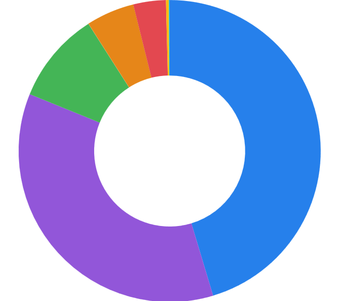

# Proof of Concept 
## Using Reveal.js

---


## Why reveal.js ?

- Slides wrote in **Markdown** <!-- .element: class="fragment" -->
- **web** rendering : local or distant <!-- .element: class="fragment" -->
- Code & animations
- Export to  **PDF** <!-- .element: class="fragment" -->
- free, open source, no licence <!-- .element: class="fragment" -->

Note:
Les puces apparaissent une par une grâce aux fragments.

---


## How does it work ?

- press S for Speeker view
- press ESC for an overview of the presentation
- You can add Speeker notes with :

```md
Note : 
this is a note visible only in speeker view
```

---

Content is just a markdown file. Want a new slide ? just add ---. Easy
Let's see an example with my app I built for students this year.


---


## EsiEDT

- **why** : ADE is a nightmare for sutdent (UI, accessibility, often down)
- **for who** : students
- **Problems solved** : all of them


press down arrow key for next slide

--

### Statistics
<div style="display: flex; align-items: center; justify-content: center;">

<div style="flex: 1; padding: 0 20px;">

| Promo | proportion |
|---|---|
| 1A | 36% |
| 2A | 10% |
| 3A |  45% |
| 4A | 3% |
| 5A | 0% |
</div>

<div style="flex: 1; padding: 0 20px;">


<!-- .element: style="max-width: 100%; border-radius: 8px;" -->

</div>

</div>

---


#### Example : ICS parsing

```python [1-3|5-8|13-20]
def parse_ics(ics_data: bytes):
    cal = Calendar.from_ical(ics_data)
    events = []

    for component in cal.walk('VEVENT'):
        summary = str(component.get("SUMMARY", "Cours sans titre"))
        location = str(component.get('LOCATION', 'Salle non précisée'))
        description = str(component.get("DESCRIPTION", ""))

        start = component.get('DTSTART').dt.isoformat() if component.get("DTSTART") else None
        end = component.get('DTEND').dt.isoformat() if component.get("DTEND") else None

        events.append({
            'title': summary,
            'location': location,
            'professor': extract_prof_name(description),
            'lesson_type': extract_lesson_type(description),
            'start_time': start,
            'end_time': end
        })
    
    return events
```
<!-- .element: class="r-stretch" -->


---

<!-- .slide: data-auto-animate -->
## Animation auto

<div style="width:80px;height:80px;background:#42affa;margin:200px" data-id="box"></div>

---

<!-- .slide: data-auto-animate -->
## Animation auto

<div style="width:80px;height:80px;background:#ff5f5f;margin-left:500px;border-radius:200px" data-id="box"></div>

This is not really useful, but it's cool and easy.

---

<!-- .slide: data-background-color="#1b1b2f" -->
## live demo


<iframe data-src="https://esiedt.anttonc.fr" width="900" height="450"></iframe>


---

## Overview

| point | reveal.js | slides |
|---|---|---|
| Versionnable (git) | ✅ | ❌ |
| fast | ✅ Markdown | ➖ |
| precise / minucious design | ➖ CSS | ✅ |
| Export PDF | ✅ | ✅ |
| collaborative | ✅  git | ✅ |


---

## Thanks !